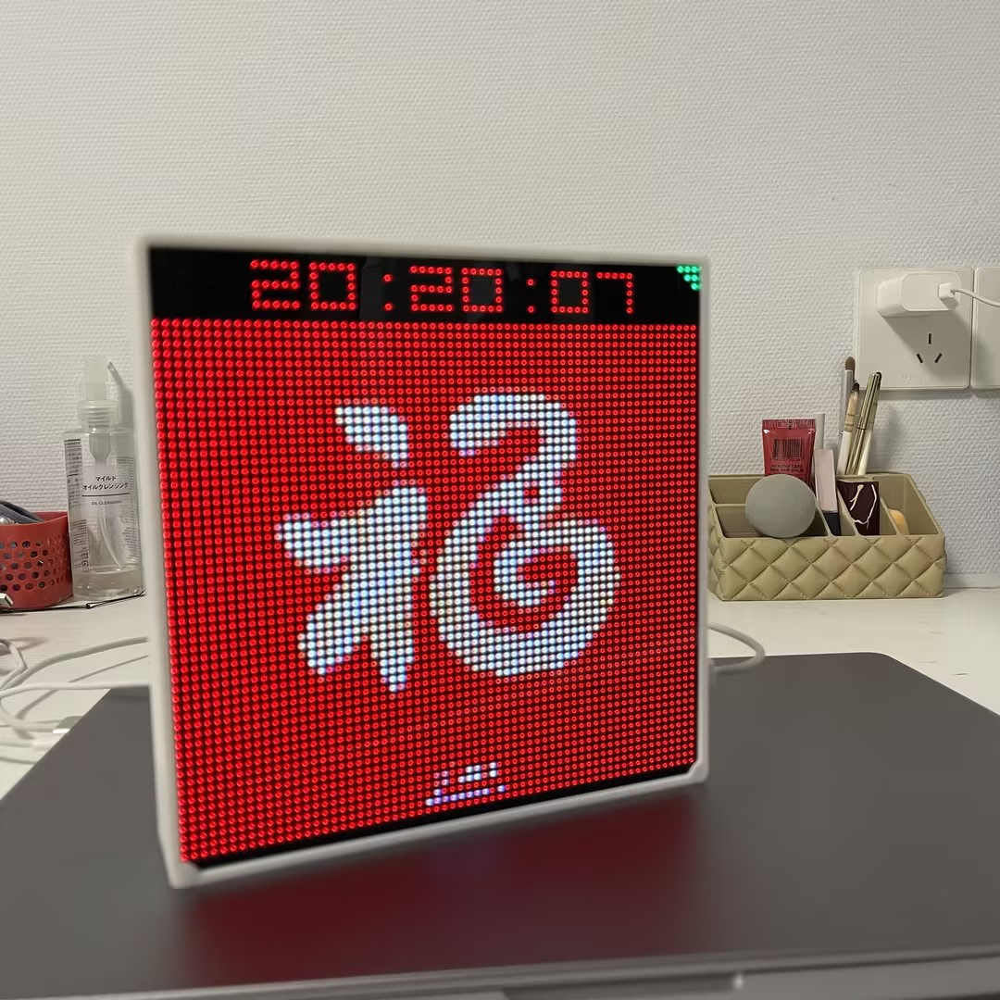

# myclock
myclock is a pixel clock based on the ESP32, featuring WiFi network time synchronization, custom background images, and a night mode.  

If you don't want to compile the code, you can upload firmware from [here](https://makerawei-1251006064.cos.ap-guangzhou.myqcloud.com/myclock/index.html)  
The LED matrix panel's driver is [ESP32-HUB75-MatrixPanel-DMA](https://github.com/mrcodetastic/ESP32-HUB75-MatrixPanel-DMA)  

  
  
